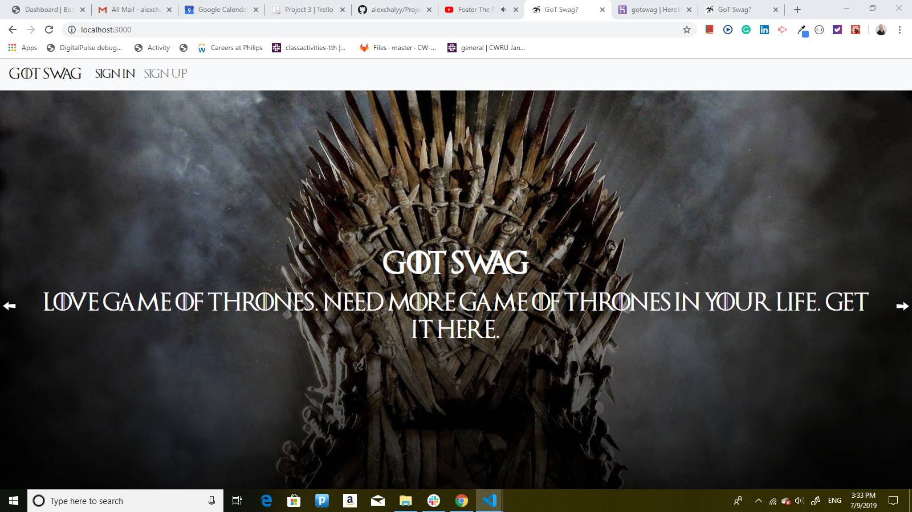
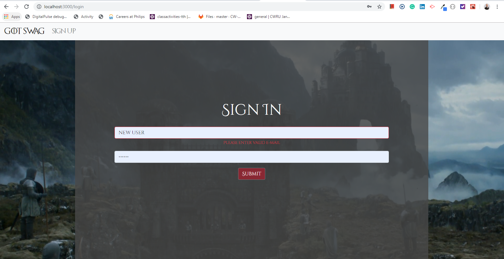
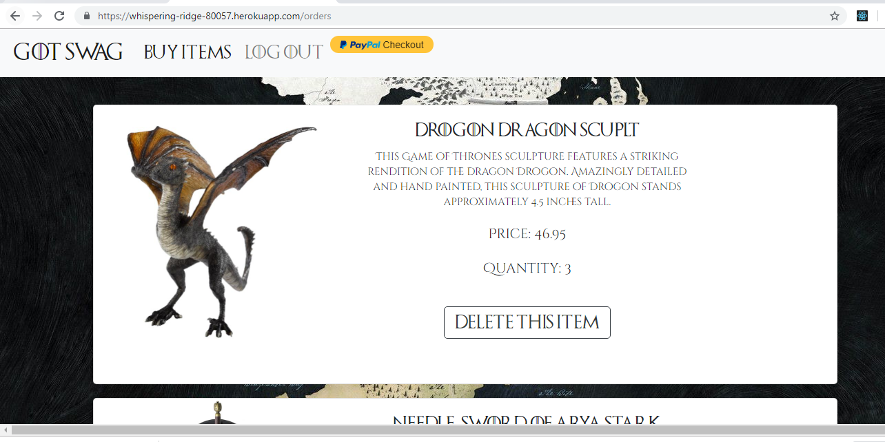
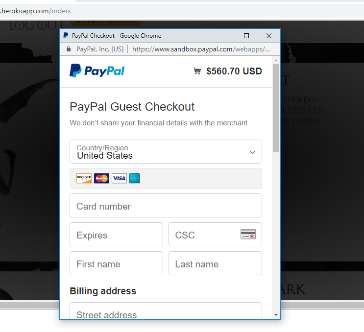

# Project Three

# Description

This website is for purchasing Game Of Thrones TV show themed souvenirs.

When user navigates to log in page, website description is displayed through carousel. There are also two options to sign in for users who are already registered and to sign up for users who want to register (screenshot is below). 

If the user clicks on sign up button, a new account registration page is opened with the fields shown in the screenshot below. If the user does not enter information in all the fields, enters a piece of information in wrong data format, or enters already previously registered user, proper validation error message is shown and user is not allowed to create an account. Otherwise, if user enters all correct information, new account is created. Afterwards, the user is navigated to sign in page, which is described next.

If the user clicks on sign in button on log in page, a log in page is displayed (screenshot is below), asking user to enter e-mail and password. If user does not enter enough information, wrong format infromation, or user that is not registered, proper validation messages are displayed. Otherwise, user is logged in and next page is opened.

After the user is logged in, sale page is opened. It has Game of Thrones souvenir inventory for sale with descriptions, pictures, and prices. It also has options to buy (screenshot is shown below). There is also navigation bar with options to log out, change account information, and go to orders page.

If the user navigates to check out page, all previously bought items, including quantities bought are displayed. User can update purchases before checkout by removing items with delete button (screenshot is below).

On the checkout page the application uses PayPal for checkout. It grabs a total of the items selected by the user. The user can choose their PayPal to buy times or use guest checkout. The address, phone number user info needed for shipping is grabbed by PayPal. If transaction is successful the message displays stating success and user is redirected to main page.

# Creation Process

# Front End

Front end files were written using react, reactstrap, availity-reactstrap-validation, and slider (availity, reactstrap, and slider are new technologies that are used). All pages are mobile responsive.

# Back End

Back end files were written using javascript, mysql, axios, node, and express. The website was deployed to Heroku server.

https://whispering-ridge-80057.herokuapp.com

